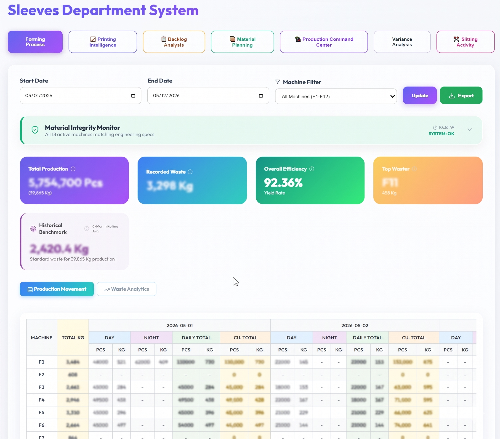
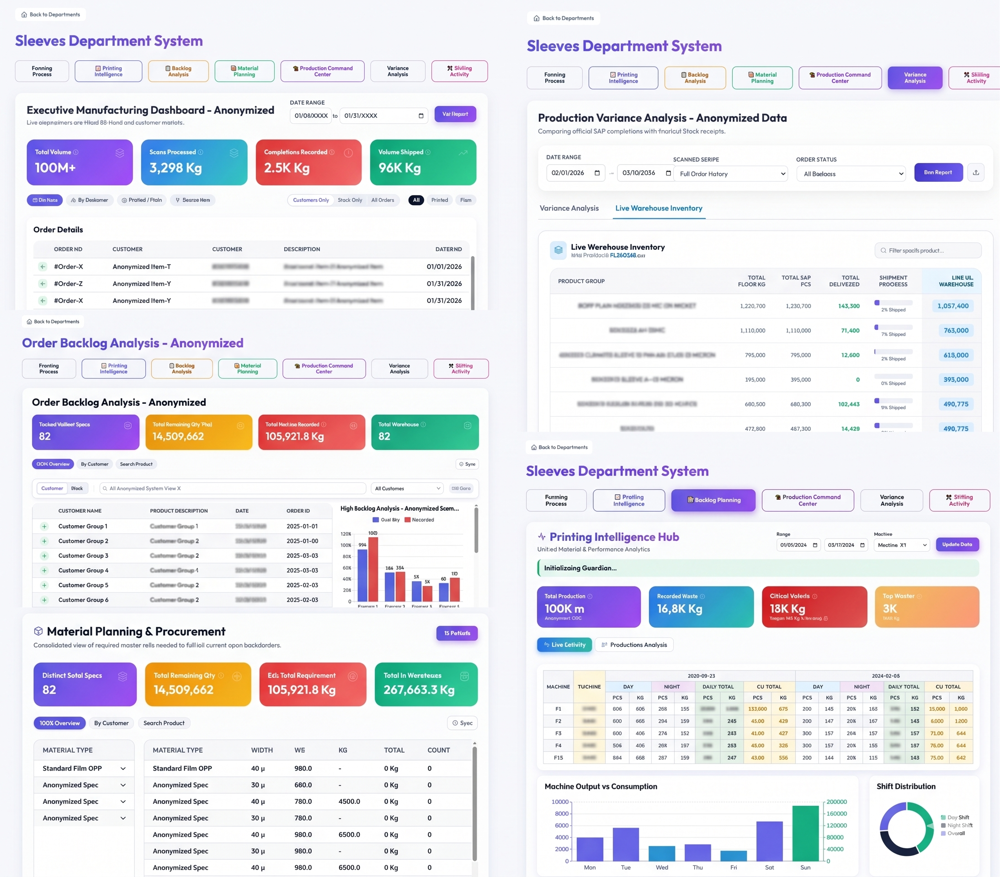
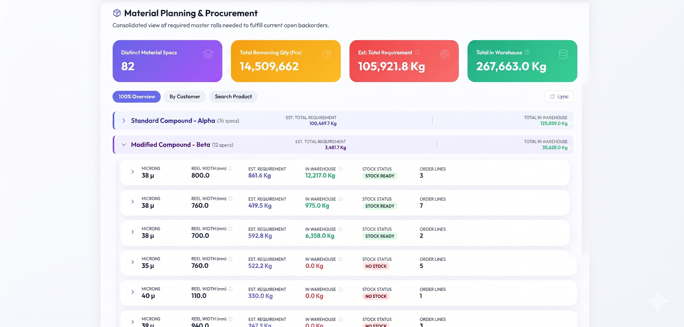
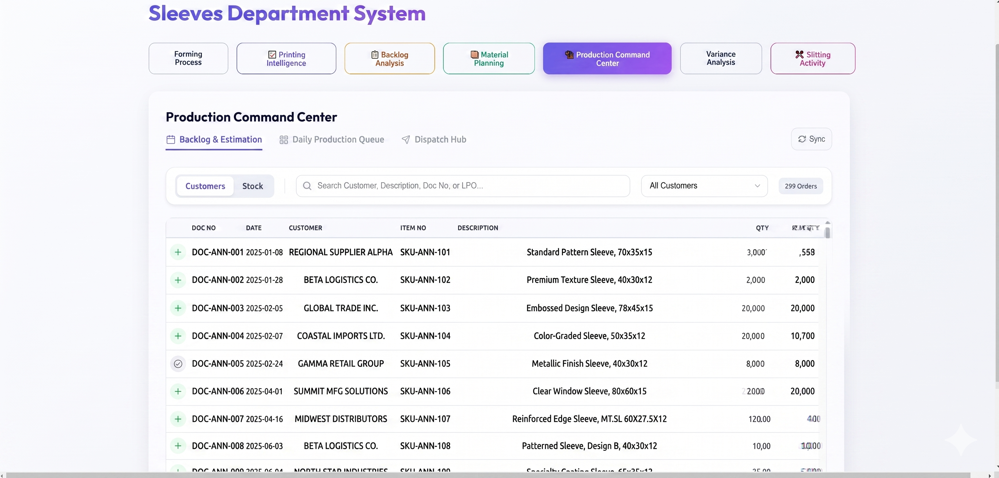
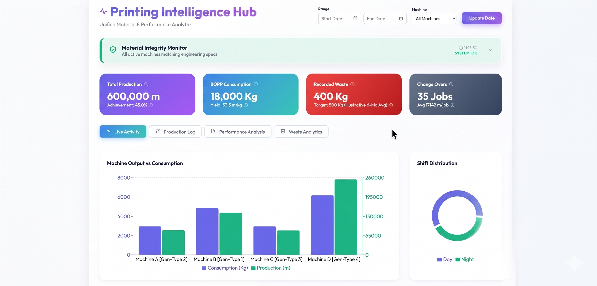
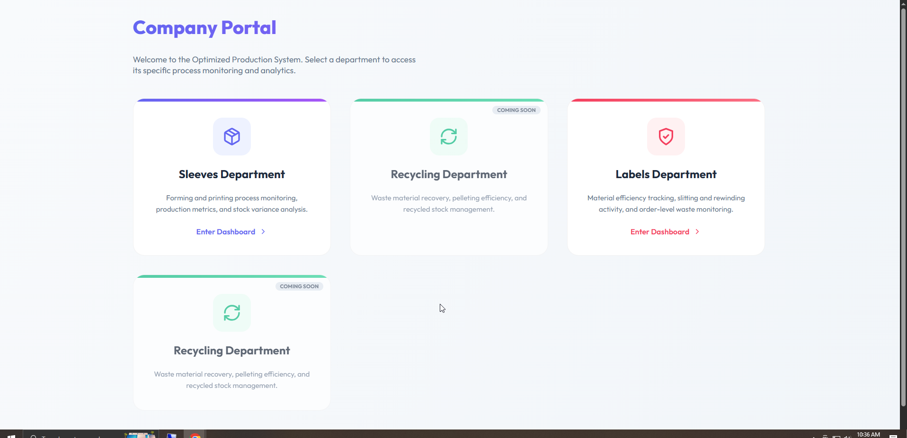

# Optimized Production and Waste Management System (PWMS)


> [!TIP]
> 🚀 **Live Interactive Demo**: You can access the fully functioning cloud showcase here: **[PWMS Live Dashboard Demo](https://pwms-local-main.vercel.app/)**  
> *(Runs completely client-side & server-isolated using our integrated offline mock database sandbox—no setup required!)*
> 
> *Note: Due to free-tier hosting on Render, the backend container automatically sleeps when inactive. If logging in for the first time, please allow **50 to 90 seconds** for the server to spin up!*


The **Optimized Production and Waste Management System (PWMS)** is a high-performance, decoupled web application designed to monitor, analyze, and optimize manufacturing metrics. It provides real-time data visualization and machine learning-driven analytics to predict waste and improve production efficiency across multiple departments.

## 🚀 Key Features

- **Multi-Department Dashboards**: Tailored analytics for Printing, Sleeves, and Labels departments.
- **Predictive Waste Analytics**: ML models identify expected waste benchmarks and flag anomalies in real-time.
- **Dynamic Visualizations**: Interactive charts for Run Meters, BOPP consumption, and Production Order vs. Virtual Stock receipts.
- **Unified Launcher**: Simplified startup for both backend and frontend development environments.
- **Modern UI/UX**: A premium, responsive design built with React and Lucide icons, focusing on clarity and professional aesthetics.

---

## 🖼️ UI Previews

Below is a gallery showcasing the system's various department dashboards, predictive analytics, and process control interfaces:

<table width="100%">
  <tr>
    <td width="50%" align="center" valign="top">
      <b>📊 Dashboard Overview</b><br/>
      
    </td>
    <td width="50%" align="center" valign="top">
      <b>📈 Analytics View</b><br/>
      
    </td>
  </tr>
  <tr>
    <td width="50%" align="center" valign="top">
      <b>⚙️ Production Metrics</b><br/>
      
    </td>
    <td width="50%" align="center" valign="top">
      <b>♻️ Waste Management</b><br/>
      
    </td>
  </tr>
  <tr>
    <td width="50%" align="center" valign="top">
      <b>🤖 ML Predictions</b><br/>
      
    </td>
    <td width="50%" align="center" valign="top">
      <b>🖥️ System Snapshot</b><br/>
      
    </td>
  </tr>
</table>

---

## 🏗️ Architectural Design

The system implements a decoupled, scalable architecture separating the React frontend from the FastAPI backend, utilizing robust data pipelines:

### Backend Architecture (FastAPI & SQL Server)
- **Modular Design**: The backend is divided into department-specific modules (e.g., `backend/departments/sleeves/`, `backend/departments/printing/`).
- **Database Layer**: Connects to three distinct MS SQL Server databases (`PTK` for Printing/Sleeves, `PTL` for Labels, `ELGON / DKL` for ERP/SAP Virtual Stock).
- **Performance Optimization**:
  - Implements **SQLAlchemy Connection Pooling** to avoid connection overhead per request.
  - Leverages **TTLCache** for API response caching, reducing redundant heavy SQL aggregations.
  - **SQL-First Aggregation**: Heavy data aggregation is pushed to the database layer via complex `GROUP BY` SQL statements to minimize network transfer.

### Frontend Architecture (React + Vite)
- **Component-Based UI**: Built using functional components, standardizing on a premium glass-card aesthetic.
- **Conditional Rendering Optimization**: Dashboards use conditional rendering rather than CSS-hiding inactive tabs to minimize DOM node count and memory footprint.
- **State Management**: Uses `React.memo` and `useMemo` hooks extensively to prevent unnecessary re-renders of complex Recharts graphs.

### Machine Learning Integration
- **Predictive Engine**: A `HistGradientBoostingRegressor` from Scikit-Learn processes historical machine, spec, and run data.
- **Real-Time Inference**: The `MLService` loads models directly from `.joblib` files, providing benchmark waste targets for new jobs on the fly.

---

## 🛠️ Best Practices Followed

- **Data Integrity Over Flexibility**: Adherence to strict SQL invariants (e.g., using `LEFT JOIN` for production metrics to prevent silent dropping of unregistered item codes).
- **Separation of Concerns**: API routes (`router.py`) are strictly separated from data queries (`queries.py`).
- **Comprehensive Auditing**: Regular mathematical audits ensure KPIs like "Planned Meters" and "Variance" exactly match real-world accounting (e.g., applying +-2% dead-bands for acceptable waste).
- **Documentation**: Extensive use of Markdown-based developer documentation (`DEVDOC.md`, `bug_fixes_audit.md`) as source-of-truth for domain terminology and complex SQL logic.

---

## 🐛 Challenges, Bugs & Solutions Encountered

Building this system required solving several complex data reconciliation challenges between production reporting and warehouse receipts:

1. **Challenge: Multi-Day Virtual Stock Variance Inflation**
   - **Bug**: The system was originally using pandas `.first()` to aggregate warehouse receipts, which silently dropped multi-day partial deliveries.
   - **Solution**: Refactored Python aggregation to properly differentiate `sum()` for Virtual Stock Receipts and `first()` for cumulative production completions.
2. **Challenge: Silent Data Dropping on Unregistered Specs**
   - **Bug**: An `INNER JOIN` in the Forming Process SQL was silently dropping production records if an item didn't exist in the specs table.
   - **Solution**: Shifted to a robust calendar-machine cross-join skeleton using `LEFT JOIN` to guarantee 100% visibility of all run time, regardless of master data completion.
3. **Challenge: Benchmark Waste Mapping Failures**
   - **Bug**: The machine ID mapping (`G2` to `PRINTING-G4`) in the SQL benchmark engine was misaligned with the frontend production logs (`PRINTING_4`), causing the ML benchmark widget to permanently show 0 Kg.
   - **Solution**: Audited and synchronized the SQL `CASE` mapping across both `SELECT` and `GROUP BY` clauses to match the exact strings populated in the UI dropdowns.
4. **Challenge: Frontend Memory Leaks with Multiple Dashboards**
   - **Bug**: Rendering all dashboards simultaneously and hiding them with `display: none` caused massive DOM inflation and sluggish tab-switching.
   - **Solution**: Implemented dynamic conditional rendering in React (`activeTab === 'printing' && <PrintingDashboard />`), reducing memory usage by >50%.

---

## ⚙️ Setup & Installation

### Prerequisites
- Python 3.10+
- Node.js (v18+)
- Microsoft SQL Server

### Environment Configuration
Create a `.env` file in the root directory (refer to `.env.example`):
```env
DB_SERVER=your_server
DB_NAME=your_db
DB_USER=your_user
DB_PASSWORD=your_password
ML_MODEL_PATH=backend/ml/models/waste_predictor.joblib
```

### Installation
```bash
git clone https://github.com/yourusername/pwms-system.git
cd pwms-system

# Backend
python -m venv .venv
source .venv/bin/activate  # Or .venv\Scripts\activate on Windows
pip install -r requirements.txt

# Frontend
cd frontend
npm install
cd ..
```

### 🏃 Running the Application

You can run the application in two ways:

#### Option 1: One-Command Containerized Setup (Docker Compose) 🐳
The repository includes a production-grade multi-stage Docker setup. You can launch the entire ecosystem (Nginx-served production React frontend + FastAPI backend) in isolated containers with a single command:
```bash
docker compose up --build
```
* **Frontend UI**: http://localhost:9091 (Served securely via Nginx with client-side SPA routing)
* **Backend API Docs**: http://localhost:9092/docs

#### Option 2: Unified Local Python Launcher
1. Make sure your virtual environment is active:
   ```bash
   .venv\Scripts\activate  # Windows
   source .venv/bin/activate  # macOS/Linux
   ```
2. Run the unified launcher script:
   ```bash
   python start_project.py
   ```
This automatically handles active port cleanups and starts the FastAPI Backend (`9092`) and Vite Dev Server (`9091`) concurrently.

---

## ☁️ Showcase Cloud Deployment Guide (Vercel + Render)
To easily share this sanitized project with interviewers and tech leads without forcing them to download or run code locally:

1. **Deploy FastAPI Backend to Render**:
   * Create a **Web Service** on [Render](https://render.com/).
   * Connect your GitHub repository.
   * Set the Start Command to: `uvicorn backend.main:app --host 0.0.0.0 --port $PORT`.
   * Add the Environment Variable: `MOCK_DATABASE=True`.
   * Keep your generated `.onrender.com` URL.

2. **Deploy React Frontend to Vercel**:
   * Create a project on [Vercel](https://vercel.com/) and connect your repository.
   * Set **Root Directory** to `frontend`.
   * Add the Environment Variable:
     * **Key**: `VITE_API_URL`
     * **Value**: Your Render backend URL (e.g. `https://pwms-backend.onrender.com`).
   * Click **Deploy**! You will receive a secure public URL (e.g., `https://pwms.vercel.app`) to share on your resume.

---

## 🔧 Audited Mock Sandbox Upgrades
To ensure a seamless interviewer experience during local or cloud testing:
* **Case-Sensitivity Mismatch Fix**: Audited query parsing routines in the mock DB layer (`mock_db_layer.py`) to align incoming search strings with all-uppercase internal evaluation maps, restoring data fetching on all slitting dashboards.
* **Failsafe Rule Refinement**: Isolated the mock estimator query matching to check for specific timestamp parameters, preventing false-positive overlaps with slitting records and ensuring 100% database-isolated uptime.

---

## 📄 License & Support
This project is proprietary and confidential. For support, please contact the development team.

