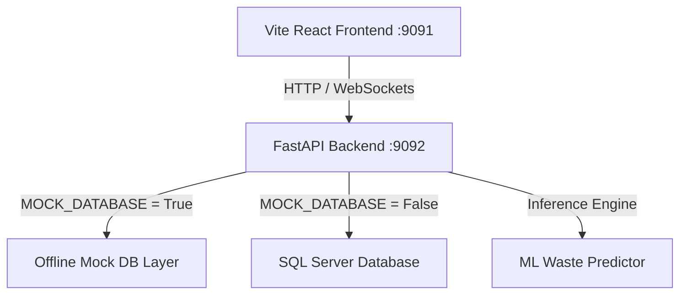

# 📘 Optimized Production and Waste Management System (PWMS)
## Unified System Documentation & Resolution Audit Log

This unified document serves as the single source of truth for the **Optimized Production and Waste Management System (PWMS)** architecture, math engines, verified bug resolutions, and developer workflows. It replaces the legacy `docs/` and `bugs/` directories.

---

## 🏛️ 1. Architecture & Decoupled Design

PWMS is a high-performance, fully decoupled industrial analytics platform designed to monitor manufacturing throughput, analyze yields, and optimize production order coverage across multiple plant departments (Forming, Printing, and Labels).



### Key Technical Specs:
*   **Frontend Hub**: React SPA styled with vanilla custom CSS, using Lucide-react iconography, glassmorphic UI panels, and conditional dynamic rendering. Bound to port `9091`.
*   **FastAPI Backend Service**: High-performance asynchronous REST and WebSocket API. Bound to port `9092` with automatic StatReload for developers.
*   **Database Isolation Layer**:
    *   **SQL Server Integration**: Multi-pool SQLAlchemy connection manager designed for high throughput.
    *   **Offline Mock Database**: A comprehensive mock DB engine (`mock_db_layer.py`) that fully mimics raw SQL cursors and yields randomized, realistic, time-range-aware metrics along with synthetic customer accounts (e.g. *Global Beverages Corp*) and product codes. Enabled via `.env` toggle `MOCK_DATABASE=True`.

---

## 🔍 2. Core Dashboard Bug Resolutions

The following records the 5 primary dashboard bugs identified during the mathematical audit of the floor metrics and their exact resolutions. These rules are invariants and must not be reverted.

### Bug 1: Filter Desync in Planning Backlog (PTS Order Book)
*   **File:** `frontend/src/pages/PTSOrderBook.jsx` (`MaterialRequirements` component)
*   **Root Cause:** The `categorizedData` computed value driving collapsible category header stats parsed the correctly filtered dataset (`activeData`), but its React `useMemo` dependency array only tracked the raw, unfiltered API response (`[data]`).
*   **Impact:** When active search queries or customer filters were applied, the rows inside each folder updated correctly, but the folder headers continued to display total fleet-wide quantities.
*   **Resolution:** Modified the `useMemo` hook dependencies from `[data]` to track `[activeData]`. The header aggregates now accurately recalculate and match the filtered body rows instantly.

### Bug 2: Inoperative Waste Benchmarks (Printing Efficiency)
*   **File:** `backend/departments/sleeves/printing/queries.py` (`PRINTING_BENCHMARK_SQL`)
*   **Root Cause:** The SQL benchmark query mapped recycler scale machine labels to production IDs using an incorrect naming convention (e.g. `PRINTING-G4` with a hyphen/wrong suffix), whereas the production database logs identified the machine as `PRINTING_4` (underscore, number 4).
*   **Impact:** The "Benchmark Waste" KPI card was permanently stuck at `0 Kg` whenever Roto or G2 machines were isolated because the frontend lookup `benchmarks.find(b => b.MachineID === selectedMachine)` could never match.
*   **Resolution:** Standardized the SQL `CASE` blocks (across both `SELECT` and `GROUP BY` statements) to map machine records to the matching `PRINTING_4` format. Benchmark cards now load historical rolling waste standards correctly.

### Bug 3: Inverted Variance Color Convention (Printing Efficiency)
*   **File:** `frontend/src/pages/PrintingEfficiencyDashboard.jsx` (Detail Table and summary KPIs)
*   **Root Cause:** The system's target meters already include built-in waste buffers. A positive variance (Actual > Planned) represents over-runs, excess waste, or poor yield. However, the UI codebase treated a positive variance as green (good) and under-runs as red (bad).
*   **Impact:** The visual color cues contradicted operational yield logic, confusing operators by labeling material waste as a positive achievement.
*   **Resolution:** Inverted the color thresholds. A `+2%` or higher overrun is now flagged as Red (warning), under-runs below `-2%` are marked Green (efficient), and a `+-2%` dead-band is designated Amber (on target).

### Bug 4: Silent Data Loss on Unconfigured Product Specs (Forming Process)
*   **File:** `backend/departments/sleeves/forming/queries.py` (`PRODUCTION_SQL`)
*   **Root Cause:** The SQL query used an `INNER JOIN` to link a master calendar x machine skeleton to the product specifications table (`SPC_GEN`).
*   **Impact:** If a machine was running a new product not yet entered into the specs database, or if an operator made a typographical error, the `INNER JOIN` evaluated to false and **silently deleted the entire machine's production group** for that date. The day appeared completely blank, understating monthly production output.
*   **Resolution:** Replaced all related `INNER JOIN` instances with `LEFT JOIN`. The date/machine grid now stays 100% intact even if product spec data is missing.

### Bug 5: Multi-Day Stock Receipt Truncation (Variance Analysis)
*   **File:** `backend/departments/sleeves/forming/router.py` (`_get_variance()` aggregation)
*   **Root Cause:** The SQL endpoint groups by `(TransactionDate, ProductionOrder)`. When an order received virtual stock receipts across multiple days, the Python Pandas aggregation algorithm used the `'first'` rule for V-Stock quantities.
*   **Impact:** The system only captured the first day's receipts, discarding all subsequent ones. This artificially inflated the calculated variance, presenting a false shortfall.
*   **Resolution:** Configured Pandas to aggregate the virtual stock quantities (`VStockReceipt_Pcs` and `VStockWght_kgs`) using `'sum'`. The system's cumulative completion fields (`CompletedQnty_Pcs` and `CompletedWght_kgs`) correctly remain aggregated by `'first'` to prevent incorrect multiplication.

---

## 🛠️ 3. Specialized Architectural & Math Logic

### 1. Queuing Theory Physics (Estimator Speeds & Queue Slicing)
*   **The Bug:** Print machines possess physical color limitations (G1 supports up to 3 colors; Roto/G2 up to 6; Uflex up to 10). If a manager requested a 7-color job, it could only run on Uflex, but the estimator averaged the load against the speed of all fleet machines (including G1), showing an impossibly short lead time.
*   **The Resolution**: Deployed **Machine-Eligible Routing**. The queue slices the active backlog by color complexity (e.g. tracking specific $>6$ color backlog solely on Uflex). Additionally, modified the speed parsing logic from unstable regex string splits (`SPEC`) to robust, weight-based logs (`WeightIn`).

### 2. Completed "Ghost" Orders in Released Status
*   **The Bug**: Many historical production orders were 100% completed (`CmpltQty >= PlannedQty`) but remained stagnant in status `R` (Released) in SAP, falsely showing up as "Upcoming Supply" and distorting coverage calculations.
*   **The Resolution**: Refactored the supply query logic to count only the **remaining balance to produce** (`PlannedQty - ProducedQty`), immediately excluding finished "ghost" orders from active planning sheets.

### 3. Chronological FIFO Delivery Allocation Algorithm
To resolve the double counting of deliveries across recurring stock runs, the database queries pull delivery data independently. The backend applies a strict Python-based FIFO algorithm:
1.  **Deque Isolation**: Deliveries are grouped by product (`ItemCode`) and stored in double-ended queues (`deque`), sorted chronologically.
2.  **Date Validation**: Order records are sorted chronologically by production date. The system iterates through orders, matching only deliveries that occurred on or after each order's `PostDate`.
3.  **Capacity Depletion**: Delivery quantities deplete the oldest available completed quantities first and are capped at the order's `VStockReceipt_Pcs` volume, preventing double counting and supporting unlinked Stock Production orders natively.

---

## 🔒 4. Security, Token-Based Authentication & Cloud Safety

To protect corporate data and ensure safe online hosting, the PWMS platform incorporates an industry-standard, stateless **Security & Authentication Layer** spanning both backend and frontend environments:

### 1. Backend Security Layer
*   **JWT Session Tokens**: The FastAPI backend integrates the standard `pyjwt` library to issue stateless cryptographically-signed **JSON Web Tokens (JWT)** on successful credentials checking.
*   **Secure Password Verification**: Access requests to `/api/auth/login` are verified against the custom admin credentials configured inside the server's `.env` configuration (default fallback: `admin` / `pwms2026`).
*   **Endpoint Route Protection**: A centralized FastAPI dependency helper (`verify_token`) intercepts all incoming HTTP requests for analytical and departmental routers (under `/api/sleeves/*`, `/api/labels/*`, `/api/ml/*`). It extracts, validates, and decodes the bearer authorization header (`Authorization: Bearer <token>`). Unauthenticated or expired requests are blocked instantly with a `401 Unauthorized` response.
*   **Safe WebSocket Handshake Routing**: Because standard web browsers do not support custom authorization headers on native WebSocket connections (`ws://`), the real-time notification sockets remain public. All active state mutations (e.g. creating dispatches, archiving, bulk signals) are securely wrapped under standard HTTP bearer verification.

### 2. Frontend Session & UX Integration
*   **Glassmorphic Login Portal**: If no active `pwms_auth_token` resides inside `localStorage`, the frontend bypasses general routing and loads a premium, dark HSL glassmorphic Login screen.
*   **One-Click Guest Access**: For interviewers' and tech leads' convenience, a prominent guest login button simulates a natural typing/validation delay, automatically signs in using the local mock credentials, and routes to the Hub.
*   **Centralized Header Interception**: The frontend fetch wrapper (`api.js`) automatically parses and appends active tokens as headers for all REST API endpoints. If a server-side `401 Unauthorized` token expiry occurs, the wrapper immediately flushes `localStorage` and reloads the viewport, ensuring zero session leaks.

---

## 💻 5. Developer Quickstart & Environment Setup

### Environment Variables (`.env`)
Configure your local environment variables in a `.env` file at the root:
```env
SQL_SERVER=127.0.0.1
SQL_DATABASE=MOCK_DB
SQL_USER=demo_user
SQL_PWD=demo_password
SQL_DRIVER=ODBC Driver 17 for SQL Server
MOCK_DATABASE=True
ML_MODEL_PATH=backend/ml/models/waste_predictor.joblib
```

### Installation & Run Steps

You can choose between running the project containerized via Docker (highly recommended for showcases) or running it locally via raw Python/Node:

#### Option A: Containerized Runner (Docker Compose) 🐳
Launch the complete pre-configured ecosystem (React production build inside Nginx container + FastAPI REST service container) with a single command:
```cmd
docker compose up --build
```
*   **React Frontend Hub**: [http://localhost:9091](http://localhost:9091) (Served via Nginx, including custom client-side router fallback rules)
*   **FastAPI REST APIs**: [http://localhost:9092/docs](http://localhost:9092/docs) (Backend swagger documentation)

---

#### Option B: Standard Native CLI Runner
1.  **Setup Virtual Environment & Install Python Packages**:
    ```cmd
    python -m venv .venv
    .venv\Scripts\activate  # Windows
    pip install -r requirements.txt
    ```
2.  **Install Frontend Packages**:
    ```cmd
    cd frontend
    npm install
    cd ..
    ```
3.  **Launch the PWMS Project Concurrently**:
    ```cmd
    start.bat
    ```
    This executes `python start_project.py`, which kills any lingering processes on ports `9091` and `9092` and starts the Vite development server and the FastAPI backend.

---

### ☁️ Cloud Showcase Deployment Guide (Vercel & Render)
To deploy this project to the public internet for a live interviewer demo:

1.  **FastAPI Backend (Render)**:
    *   Deploy as a **Web Service** from GitHub on [Render](https://render.com/).
    *   Start Command: `uvicorn backend.main:app --host 0.0.0.0 --port $PORT`
    *   Set Environment Variable: `MOCK_DATABASE=True`.
    *   Obtain backend URL (e.g. `https://pwms-backend.onrender.com`).

2.  **React Frontend (Vercel)**:
    *   Deploy Project from GitHub on [Vercel](https://vercel.com/).
    *   Set Root Directory to: `frontend`.
    *   Add Environment Variable:
        *   **Key**: `VITE_API_URL`
        *   **Value**: `https://pwms-backend.onrender.com` (Your Render URL).
    *   Hit **Deploy**!

